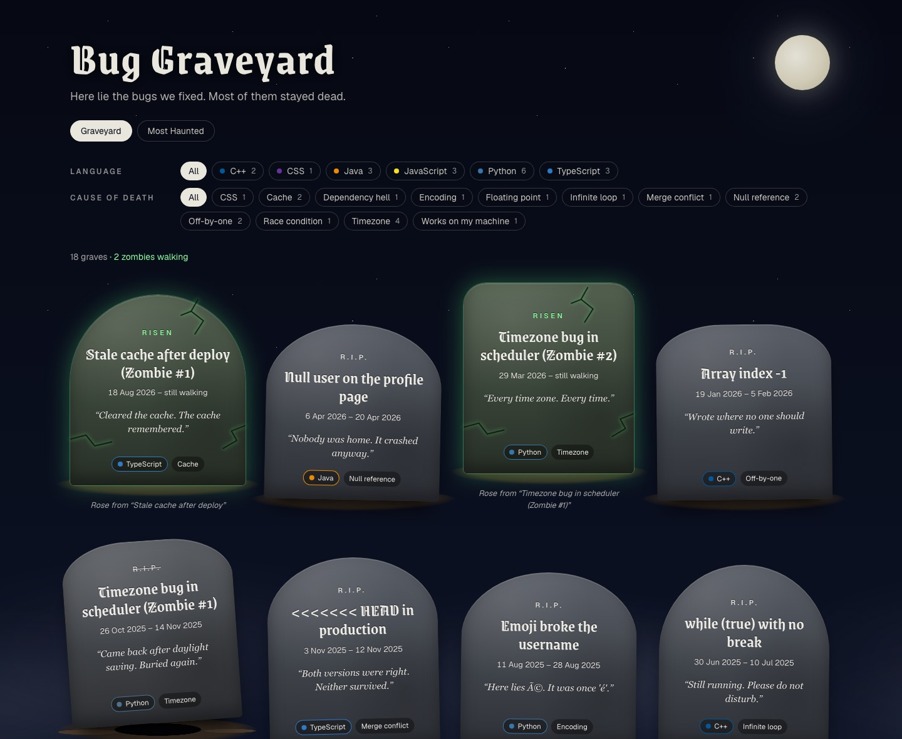
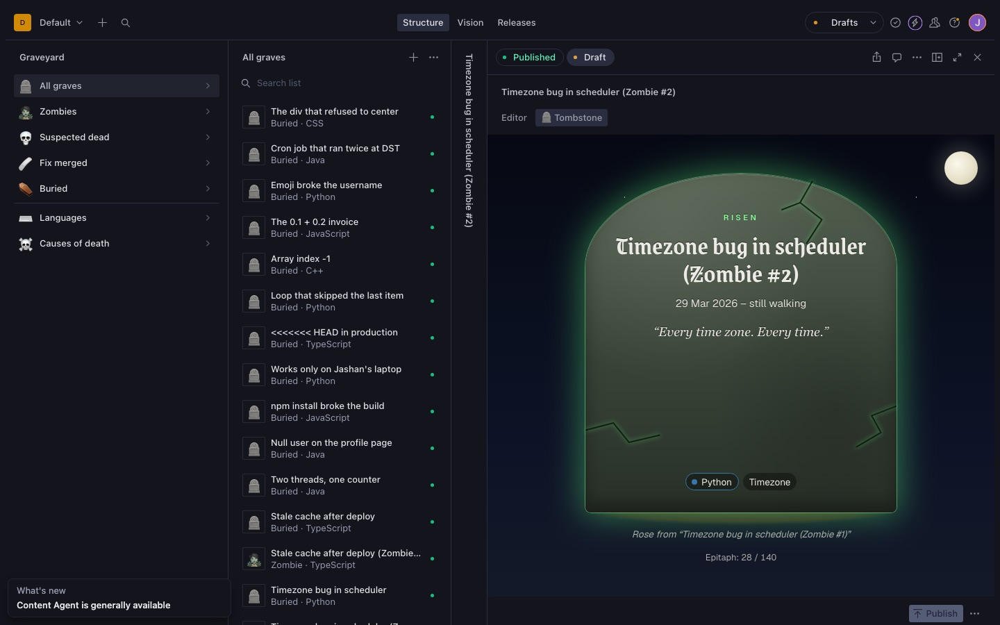
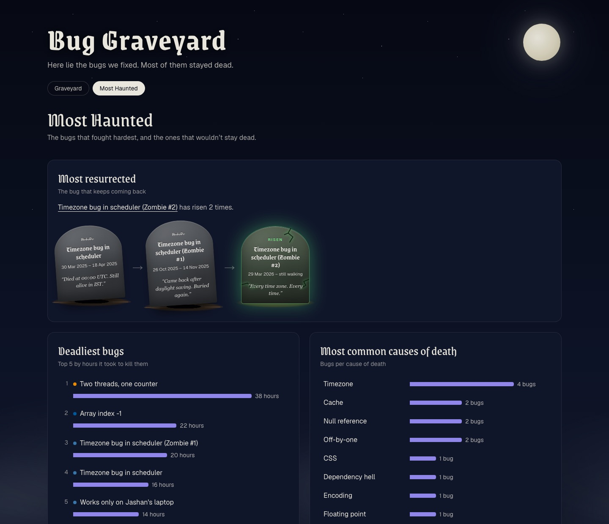

# Bug Graveyard 🪦

**A graveyard for the bugs you've fixed, where regressions climb out of their graves as zombies.**

Live: **https://bug-graveyard.vercel.app** · Built with Next.js + Sanity for the DEV Sanity Challenge.



## Features

- **A tombstone for every fixed bug.** Each stone shows the bug's name, birth and death
  dates, epitaph, language and cause of death. Stones come in three looks: *resting*,
  *disturbed* (the grave is empty because the bug came back) and *zombie* (cracked and
  glowing). You can filter by language or cause of death.
- **Zombie chains.** A regression is a new bug whose `previousLife` points at the grave
  it rose from. Every grave page shows its past lives, oldest first, and any zombies
  that rose from it. Zombies can die and rise again.
- **Lifecycle actions in the Studio.** Three custom document actions: 🩹 **Mark fix
  merged**, 🪦 **Declare buried** (only after the fix has held for 7 days; until then
  it reads "Can bury in N days"), and 🧟 **Report resurrection**, which asks you to
  confirm, creates the zombie and opens it. They fill in the read-only dates and the
  resurrection count, so those fields record what actually happened.
- **A live Tombstone view in the Studio.** Bug documents have an "Editor" tab and a
  "🪦 Tombstone" tab. The Tombstone tab renders the site's own `Tombstone` component
  and updates as you type, with a counter for the 140-character epitaph limit.
- **The "Most Haunted" leaderboard,** built from GROQ aggregations: the deadliest bugs,
  the most haunted languages, the most common causes of death, and the most resurrected
  chain.
- **A content importer.** Write bugs, with their real dates, in
  [`content/graves.ts`](content/graves.ts), then import them. The importer checks every
  entry (known names, real dates, the burial rule, valid zombie chains) and writes
  nothing if anything is wrong.
- **Always up to date.** `<SanityLive />` updates open tabs within seconds of a publish,
  and a signed Sanity webhook refreshes the cache when nobody has the site open.
- **Share images.** Every grave gets its own Open Graph image with its tombstone, made
  with `next/og`.
- **Sanity Functions.** The *gravedigger*, a scheduled function, runs daily and buries
  every bug whose fix has held for 7 days. The *coroner*, a document function, uses an
  Agent Action to draft an epitaph and a cause of death for each new suspected-dead bug;
  a person accepts it in the Studio with **✅ Accept coroner's report**. See
  [Functions](#functions).
- **Report a dead bug.** A public page ([`/report`](app/(site)/report)) where anyone can
  report a bug. The coroner drafts its epitaph, the page lists it as awaiting approval,
  and it only joins the graveyard once it's approved in the Studio. It has a honeypot,
  per-visitor and daily limits (counted in private documents), length limits, and link
  and profanity checks.
- **The Morgue, an App SDK app.** A live board in the Sanity Dashboard of every bug that
  isn't resting yet (suspected dead, walking, waiting, ready to bury), with the same
  lifecycle actions on each card. See [`apps/morgue`](apps/morgue).





## Schema design

There are three document types, in [`sanity/schemaTypes`](sanity/schemaTypes).

**`bug`** is the one that matters:

| Field | Why it's there |
|---|---|
| `name`, `slug`, `epitaph` | What's carved on the stone; the epitaph is limited to 140 characters |
| `language` → `language`, `causeOfDeath` → `causeOfDeath` | References, so they can be renamed and recoloured in one place, filtered and counted |
| `severity`, `killedBy`, `hoursToKill` | The details on the death certificate |
| `status` | `suspected-dead` → `fix-merged` → `buried`, or `zombie` |
| `bornAt`, `fixMergedAt`, `buriedAt` | Dates in UTC. The last two are read-only and set by the lifecycle actions |
| `previousLife` → `bug` | **A reference back to `bug` itself.** A zombie is just a bug with a previous life |
| `timesResurrected` | How far down its chain the bug is; read-only |

**Why a zombie is a `bug` and not its own type:**
- A zombie gets fixed and buried like any other bug, so it needs every field a bug has.
- One type pointing at itself gives chains of any length, one query and one component.
- Whether a grave is *disturbed* isn't stored. GROQ works it out when asked:
  `count(*[_type == "bug" && previousLife._ref == ^._id]) > 0`.

**`language`** (a name and a brand colour) and **`causeOfDeath`** (a title and a
description) are small documents that bugs reference. That keeps the filters, badges
and leaderboard counts consistent. Recolour a language once and every tombstone
follows.

## Stack

- **Next.js 16** (App Router, TypeScript, Tailwind CSS v4, `next/og`), deployed on
  **Vercel**
- **Sanity:** Studio v5 embedded at `/studio`, `next-sanity` 13, GROQ, the Live Content
  API, TypeGen (typed queries), and a signed webhook to `/api/revalidate`
- **The Morgue:** the Sanity App SDK (`@sanity/sdk-react` 3), in its own package in
  `apps/morgue`

A Sanity Workflows experiment (the lifecycle as a workflow definition, with engine tests)
is on the [`explore/workflows`](https://github.com/jashanpreet-k/bug-graveyard/tree/explore/workflows)
branch. It isn't merged, because the Workflows Studio plugin needs Studio 6.

## Running it locally

You'll need Node 20 or later, and your own Sanity project (free).

```bash
git clone https://github.com/jashanpreet-k/bug-graveyard.git
cd bug-graveyard
npm install
npx sanity@latest login
```

1. Create a Sanity project, either at [sanity.io/manage](https://www.sanity.io/manage)
   or with `npx sanity@latest init --bare`. Add `http://localhost:3000` as a CORS origin
   **with credentials allowed**, which the Studio needs.
2. Create `.env.local` (git ignores it):

   ```bash
   NEXT_PUBLIC_SANITY_PROJECT_ID="your-project-id"
   NEXT_PUBLIC_SANITY_DATASET="production"
   # Only needed for the webhook route; make one with: openssl rand -hex 32
   SANITY_REVALIDATE_SECRET="a-long-random-string"
   # Only needed for the report page: a Sanity API token with the Editor role
   SANITY_WRITE_TOKEN="..."
   ```

3. Add the languages and causes of death, then import the graves:

   ```bash
   npx sanity exec scripts/seed.ts --with-user-token
   npx sanity exec scripts/import-graves.ts --with-user-token -- --dry-run   # check first
   npx sanity exec scripts/import-graves.ts --with-user-token
   ```

4. Run `npm run dev` and open http://localhost:3000 for the site, or
   http://localhost:3000/studio for the Studio.

| Command | What it does |
|---|---|
| `npm run dev` / `npm run build` / `npm run lint` | The usual |
| `npm run typegen` | Regenerates `sanity/types.ts` from the schema and every `defineQuery` |
| `scripts/seed.ts` | Adds the languages and causes of death (skips any that already exist) |
| `scripts/import-graves.ts` | Imports `content/graves.ts`. Add `-- --dry-run` to check only, or `-- --delete-test` to remove test bugs |
| `scripts/seed-test-bugs.ts` | Three throwaway test bugs; add `-- --delete` to remove them |

## Deploying

Deploy to Vercel with the same environment variables, keeping
`SANITY_REVALIDATE_SECRET` and `SANITY_WRITE_TOKEN` in production only and marked
sensitive. Then, in Sanity:

- **Add the production URL as a CORS origin, with credentials allowed.**
- **Create a webhook:**
  - URL: `POST https://<your-site>/api/revalidate`
  - Dataset: `production`
  - Triggers: create, update and delete
  - Filter: `_type in ["bug", "language", "causeOfDeath"]`
  - Projection: `{_id, _type}`
  - Secret: the same `SANITY_REVALIDATE_SECRET`

## Functions

Two [Sanity Functions](https://www.sanity.io/docs/functions), defined in
[`sanity.blueprint.ts`](sanity.blueprint.ts) and deployed to Sanity (not Vercel):

- **`functions/gravedigger`** (scheduled, daily at 00:15 UTC): sets `status: buried` and
  `buriedAt` on every published bug whose fix merged at least 7 days ago, using the same
  rules as the Studio (`sanity/lib/lifecycle.ts`). It skips bugs with unpublished changes.
- **`functions/coroner`** (on create): when a bug is published as suspected dead with no
  epitaph, it asks the Agent Actions Prompt for a funny epitaph (at most 140 characters,
  in the style of the existing graves) and a cause of death from the existing ones. It
  writes them only to `coronerEpitaph`, `coronerCause` and `coronerStatus: "awaiting
  approval"`. The real fields change only when a person accepts the report.

```bash
npx sanity@latest functions test gravedigger --project-id <id> --dataset production --with-user-token
DRY_RUN=1 npx sanity@latest functions test gravedigger ...   # log only
npx sanity@latest functions test coroner --document-id <bug-id> --project-id <id> --dataset production --with-user-token
npx sanity@latest blueprints deploy
```

Each coroner report uses one AI credit. On the Free plan, scheduled functions can run at
most daily.

## About the graves

The bugs in `content/graves.ts` are classic, well-known developer bugs (off-by-one
errors, `0.1 + 0.2`, the div that won't centre), written in the voice of this
graveyard. They aren't a record of any one person's history.

The build log behind this project, phase by phase, is in [NOTES.md](NOTES.md). The
fonts in `assets/fonts` (Grenze Gotisch, and a small Noto Sans subset) are used under
the SIL Open Font License; the licences are next to them.
