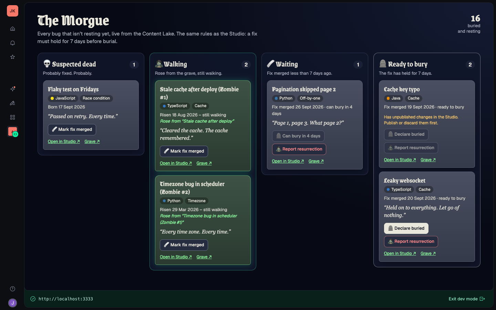

# The Morgue 🪦

A small [Sanity App SDK](https://www.sanity.io/docs/app-sdk) app for Bug Graveyard. It runs
in the Sanity Dashboard and shows every bug that isn't resting yet, live, in four columns:
**Suspected dead**, **Walking** (zombies), **Waiting** (fix merged, under 7 days ago) and
**Ready to bury**.

Each card has the same lifecycle actions as the Studio, with the same rules:

- **🩹 Mark fix merged** on a suspected-dead bug or a walking zombie
- **🪦 Declare buried** once the fix has held for 7 days (until then: "Can bury in N days")
- **🧟 Report resurrection**, after a confirm, creates the zombie already published; a
  grave only rises once

The buttons write straight to the published bug (`liveEdit` document handles), so like
the Studio's actions they wait while a bug has unpublished Studio changes. The rules
themselves (`BURIAL_WAIT_DAYS`, `daysUntilBurial`, `zombieName`, `slugify`) come from the
site's [`sanity/lib/lifecycle.ts`](../../sanity/lib/lifecycle.ts), shared with the Studio.



## Running it

```bash
cd apps/morgue
npm install
npm run dev
```

Then open the Dashboard link it prints (you need to be a member of the project's
organization). `npm run build` builds it and `npm run deploy` deploys it to the
organization's Dashboard.

**Use the npm scripts, not `sanity dev` directly.** The Sanity CLI finds its project by
looking for a Studio config (`sanity.config.ts`) in the current folder and every parent
folder before it looks for an app config. This app sits inside the site's repo, whose
root has the site's Studio config, so plain `sanity dev` here would start the site's
Studio instead (and `sanity deploy` would deploy it). [`run-sanity.mjs`](run-sanity.mjs)
runs the CLI from a mirror folder outside the repo instead.

## Files

- `src/App.tsx`: `<SanityApp>` with the project and dataset
- `src/Morgue.tsx`: the board; each column is a `useDocuments` list with a GROQ filter
- `src/BugCard.tsx`: a card (`useDocumentProjection`) and its lifecycle buttons
  (`useApplyDocumentActions` with `editDocument` and `createDocument`)
- `src/facts.ts`: one live `useQuery` for which bugs have Studio drafts and which graves
  have already risen
